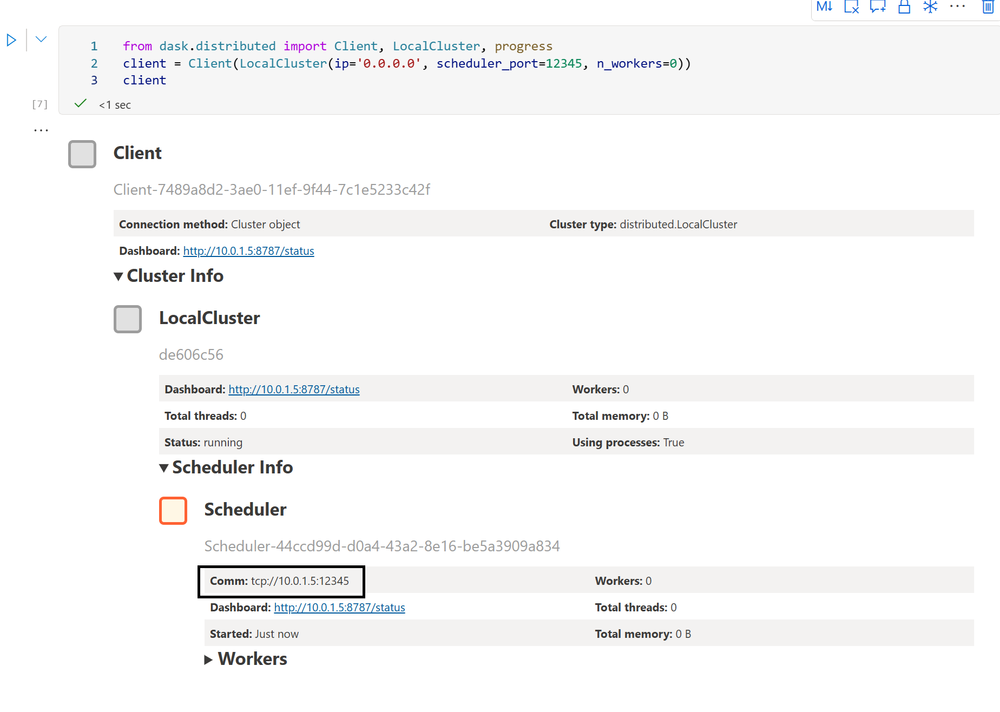

To run this Dask example, you'll have to choose the Python 3.8 - AzureML kernel in the notebook, since dask is already installed in that virtual env. 
Next start the scheduler by running:
```
from dask.distributed import Client, LocalCluster, progress
client = Client(LocalCluster(ip='0.0.0.0', scheduler_port=12345, n_workers=0))
client
```

Make sure to check the ip-address of your Compute vm, you can find it at the comm field in the Scheduler box:


