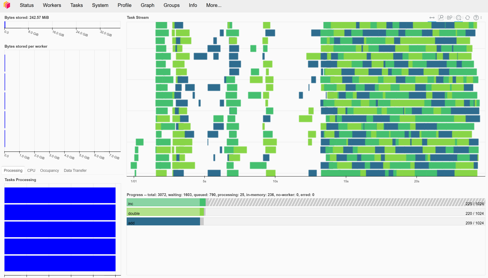

To run this Dask example, you'll have to choose the Python 3.8 - AzureML kernel in the notebook, since dask is already installed in that virtual env. 
Next start the scheduler by running:
```
from dask.distributed import Client, LocalCluster, progress
client = Client(LocalCluster(ip='0.0.0.0', scheduler_port=12345, n_workers=0))
client
```

Make sure to check the ip-address of your Compute vm, you can find it at the comm field in the Scheduler box:


To add workers: you can use a simple Slurm job script:
```
#!/bin/bash

conda init
source activate base
pip install dask==2023.2.0 distributed==2023.2.0 
export PATH=$PATH:/home/azureuser/.local/bin
dask worker tcp://10.0.1.5:12345
```

Make sure to check the scheduler address on the last line, that takes care of connecting back to the Dask controller you started in the first step.
Submit the script through the terminal with the following command, in this case to add 5 worker vm's:
```
sbatch -p f4s --array 1-4 ./dask.job
```

Now it is a good time to add some small functions to be used for calculations:
```
import time
import random

def inc(x):
    time.sleep(random.random())
    return x + 1

def double(x):
    time.sleep(random.random())
    return 2 * x

def add(x, y):
    time.sleep(random.random())
    return x + y
```

and to create an empty array for the results:
```
zs = []
``` 

To start the actual work, this is a small loop that uses the functions to manipulate the input and adds all of them in the output array:
```
%%time

for i in range(1024):
    x = client.submit(inc, i)     # x = inc(i)
    y = client.submit(double, x)  # y = inc(x)
    z = client.submit(add, x, y)  # z = inc(y)
    zs.append(z)
```

In the Dask dashboard, for which the link you can find through Compute -> Applications (you may have to press the 3 dots to expand), 
you should now be able to see the tasks being executed:


Once you are done, shutdown the dask controller and all of it's workers. This will finalize the jobs and shut down the worker vm's as well:
```
client.shutdown()
```
