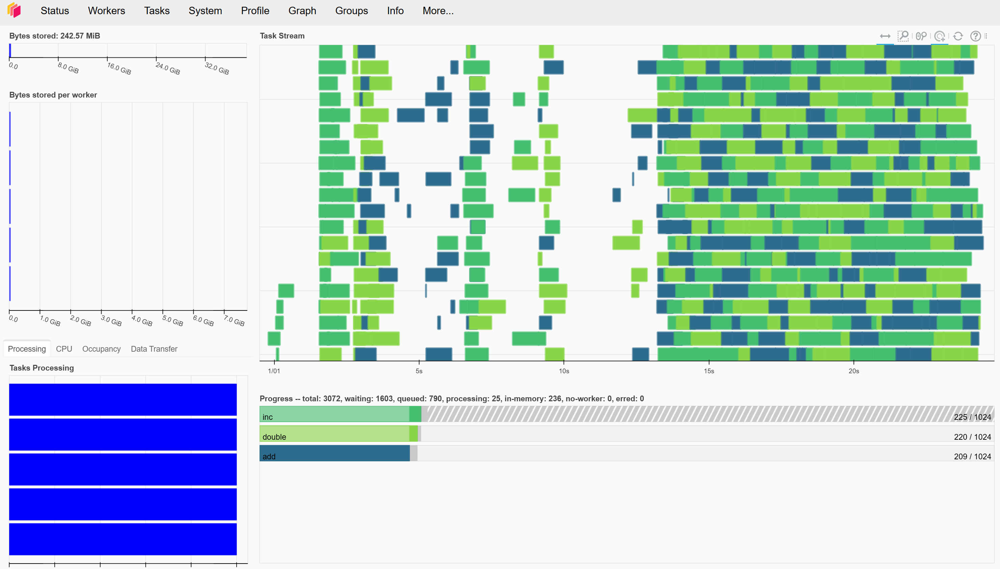

# Dask on amlhpc

Run a distributed Dask cluster on Azure Machine Learning using the built-in amlhpc dask commands:

- `dask-scheduler-up` — run a Dask scheduler on this Compute Instance (CI)
- `dask-up` — submit a pool of AmlCompute worker VMs that connect back to the scheduler
- `dask-down` — cancel the worker pool so the VMs scale to zero

The scheduler binds to the CI's VNet-private IP (auto-detected via IMDS) and prints a `tcp://HOST:8786`
address. Both the worker pool (`dask-up --scheduler`) and your notebook (`Client("tcp://HOST:8786")`)
connect to that same address. Everything runs inside the workspace VNet, so no hardcoded IPs and no
manual worker scripts are needed.

Choose the **Python 3.8 - AzureML** kernel for the notebook, since dask is already installed there.

## Connect your terminals to the workspace

`dask-scheduler-up`, `dask-up` and `dask-down` need the workspace environment variables
(`SUBSCRIPTION`, `CI_RESOURCE_GROUP`, `CI_WORKSPACE`). If you deployed the cluster with `deploy init`,
those exports were written to `~/.amlhpc/<clustername>.sh`. In **every** terminal you open, source the
profile first, then confirm the connection:
```bash
source ~/.amlhpc/<clustername>.sh
sinfo
```
`sinfo` should list your partitions (e.g. `f4s`). Inside an Azure Machine Learning Compute Instance,
`CI_RESOURCE_GROUP` and `CI_WORKSPACE` are usually already set, so sourcing the profile mainly restores
`SUBSCRIPTION` — but sourcing it is the reliable way to target a specific cluster.

## 1. Start the scheduler (terminal 1, on the CI)

```bash
dask-scheduler-up
```
This stays in the foreground and prints the address the workers and client both use:
```
scheduler address (use for dask-up --scheduler and Client): tcp://10.0.1.5:8786
dashboard: http://10.0.1.5:8787
```
Leave this terminal running. Copy the `tcp://…:8786` address for the next steps.

## 2. Add worker VMs (terminal 2, on the CI)

Submit a pool of 4 worker VMs on the `f4s` partition, all attached to the scheduler and tagged with a
session id so you can tear them down later:
```bash
dask-up -p f4s -s tcp://10.0.1.5:8786 --session pi-demo -N 4
```
`dask-up` prints one line — `jobname  session  pool  nodes` — and returns immediately; the AmlCompute
job stays *Running* for the life of the session while the workers run in the foreground. The workers
auto-install a matching `dask`/`distributed` version if the image differs, so no image rebuild is
needed. Watch them register in the client widget (or the Dask dashboard) before running the calculation.

> To add more capacity, run `dask-up` again against another partition, reusing the same
> `--scheduler` and `--session`, e.g. `dask-up -p f16s -s tcp://10.0.1.5:8786 --session pi-demo -N 8`.

## 3. A real calculation: estimate π with distributed Monte Carlo

From the notebook, connect a client to the running scheduler by its address:
```python
from dask.distributed import Client, progress
client = Client("tcp://10.0.1.5:8786")   # the address dask-scheduler-up printed
client
```

Throw random darts at the unit square; the fraction landing inside the quarter circle approximates π/4.
The work is embarrassingly parallel, so each task runs independently on a worker VM and we reduce the
counts. More samples (and more workers) give a closer estimate — a result you can actually check.

Define the per-task worker function:
```python
import random

def count_inside(n_samples, seed):
    rng = random.Random(seed)
    inside = 0
    for _ in range(n_samples):
        x, y = rng.random(), rng.random()
        if x * x + y * y <= 1.0:
            inside += 1
    return inside
```

Then fan the tasks out across the cluster, gather the counts, and compute π:
```python
%%time

n_tasks = 512
samples_per_task = 2_000_000
total_samples = n_tasks * samples_per_task

futures = [client.submit(count_inside, samples_per_task, seed) for seed in range(n_tasks)]
progress(futures)

inside_total = sum(client.gather(futures))
pi_estimate = 4.0 * inside_total / total_samples

print(f"samples : {total_samples:,}")
print(f"pi ~    : {pi_estimate}")
print(f"error   : {abs(pi_estimate - 3.141592653589793):.2e}")
```

With ~1e9 samples the estimate typically lands within a few 1e-4 of π. In the Dask dashboard — the link
is under Compute -> Applications (you may have to press the 3 dots to expand), or the
`http://HOST:8787` address the scheduler printed — you can watch the tasks being distributed across the
worker VMs:


## 4. Tear down

When you are done, disconnect the client and stop the worker session. `dask-down` cancels every worker
pool tagged with the session id; the AmlCompute nodes then go idle and scale to zero, so you stop paying
for them:
```python
client.close()   # in the notebook
```
```bash
dask-down --session pi-demo    # terminal 2
```
Finally, stop the scheduler by pressing `Ctrl-C` in terminal 1.

## Driving it remotely (no CI terminal): `sbatch` scheduler + `srun` client

The workflow above assumes you have terminals open *on* the Compute Instance. You can also drive the
whole thing from a workstation that only has the amlhpc CLI and `az` login (no VNet access, no IMDS) by
running the scheduler and client *as jobs on the CI* — they share the CI network namespace, so the
scheduler still binds the CI's VNet-private IP and the client can reach it and the workers.

First find the CI's private IP (jobs on the CI see it via IMDS):
```bash
srun --wrap="curl -s -H Metadata:true 'http://169.254.169.254/metadata/instance/network/interface/0/ipv4/ipAddress/0/privateIpAddress?api-version=2021-02-01&format=text'"
az ml job stream -n <job-name>    # prints the IP, e.g. 10.0.1.4
```

**Scheduler — submit to the login CI partition.** The default `amlhpc-ubuntu2204` environment does not
ship dask, so pip-install it in the job. The `dask` console script lands in `~/.local/bin`, which is
**not** on the job's PATH — you must add it or `dask scheduler` fails with `exec: dask: not found`:
```bash
sbatch -p <login-ci-partition> --wrap="pip install -q dask distributed; \
  export PATH=\"\$(python -m site --user-base)/bin:\$PATH\"; \
  exec dask scheduler --host 10.0.1.4 --port 8786 --no-dashboard"
az ml job stream -n <sched-job>   # wait for 'Scheduler at: tcp://10.0.1.4:8786' and note the distributed version
```
Use `sinfo` to get the `<login-ci-partition>` name (e.g. `login-ho7iiyqefiygoz`). The scheduler job
stays *Running*; leave it up.

**Workers — same as before**, but pin `--distributed-version` to the scheduler's version (your
workstation has no `distributed` to auto-detect):
```bash
dask-up -p f4s -s tcp://10.0.1.4:8786 --session pi-demo -N 4 --distributed-version 2026.7.1
```

**Client — run via `srun`.** `srun`'s script-mode uploads the file read-only, so `chmod +x` fails;
drive the client through `--wrap` instead, base64-injecting the Python so quoting is safe:
```bash
B64=$(base64 -w0 client.py)
srun --wrap="pip install -q dask==2026.7.1 distributed==2026.7.1; echo $B64 | base64 -d > /tmp/c.py; python /tmp/c.py"
az ml job stream -n <client-job>   # watch it connect and print the pi estimate
```
where `client.py` connects with `Client("tcp://10.0.1.4:8786")`, calls `client.wait_for_workers(1)`,
then runs the same Monte Carlo submit/gather as in section 3.

**Teardown** is identical, plus cancel the scheduler job (there is no terminal to `Ctrl-C`):
```bash
dask-down --session pi-demo
az ml job cancel -n <sched-job>
```

This exact sequence was validated end-to-end: a worker on the `f4s` cluster computed
π ≈ 3.14151 (error 7.9e-05) over ~1e9 samples, with the scheduler and client running as CI jobs.
