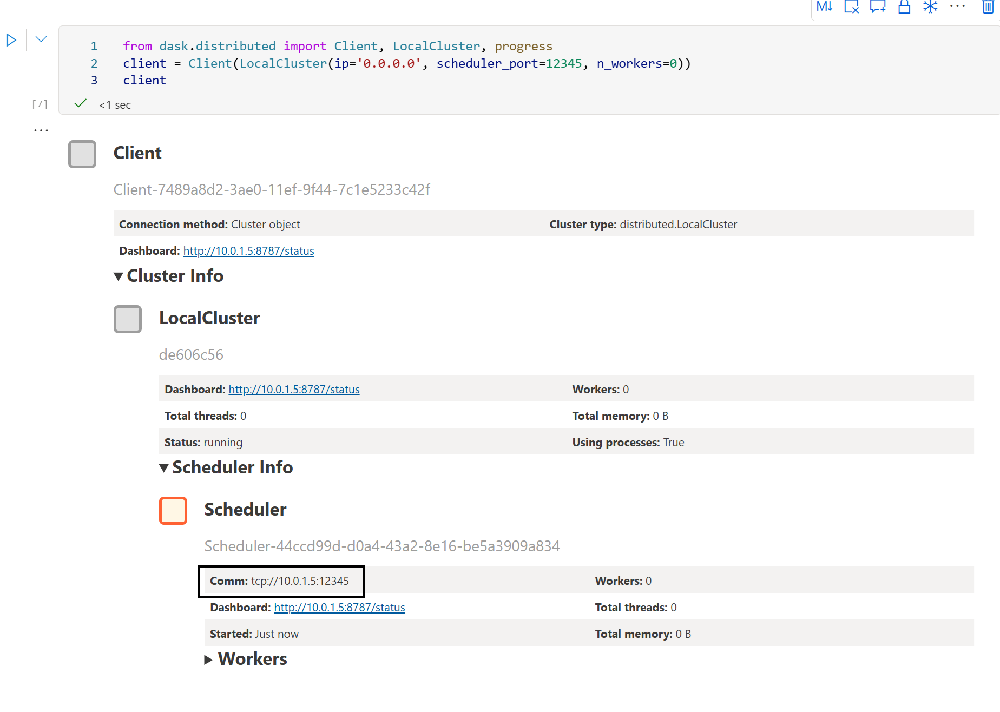

To run this Dask example, choose the Python 3.8 - AzureML kernel in the notebook, since dask is already installed in that virtual env.
Next start the scheduler by running:
```
from dask.distributed import Client, LocalCluster, progress
client = Client(LocalCluster(ip='0.0.0.0', scheduler_port=12345, n_workers=0))
client
```

Make sure to check the ip-address of your Compute vm, you can find it at the comm field in the Scheduler box:


## Connect your terminal to the workspace

Worker VMs are added from a terminal with `sbatch`, so that terminal needs the workspace environment
variables (`SUBSCRIPTION`, `CI_RESOURCE_GROUP`, `CI_WORKSPACE`). If you deployed the cluster with
`deploy init`, those exports were written to `~/.amlhpc/<clustername>.sh`. Source it, then confirm the
connection:
```
source ~/.amlhpc/<clustername>.sh
sinfo
```
`sinfo` should list your partitions (e.g. `f4s`). Inside an Azure Machine Learning Compute Instance,
`CI_RESOURCE_GROUP` and `CI_WORKSPACE` are usually already set, so sourcing the profile mainly restores
`SUBSCRIPTION` — but sourcing it is the reliable way to target a specific cluster.

## Add workers

Use a simple Slurm job script:
```
#!/bin/bash

conda init
source activate base
pip install dask==2023.2.0 distributed==2023.2.0 
export PATH=$PATH:/home/azureuser/.local/bin
dask worker tcp://10.0.1.5:12345
```

Put the scheduler address from the first step on the last line; that is what connects each worker back
to the Dask controller. Submit the script to add 4 worker VMs:
```
sbatch -p f4s --array 1-4 ./dask.job
```
Watch them register in the client widget (or the Dask dashboard) before running the calculation.

## A real calculation: estimate π with distributed Monte Carlo

Throw random darts at the unit square; the fraction landing inside the quarter circle approximates π/4.
The work is embarrassingly parallel, so each task runs independently on a worker VM and we reduce the
counts. More samples (and more workers) give a closer estimate — a result you can actually check.

First define the per-task worker function:
```
import random

def count_inside(n_samples, seed):
    rng = random.Random(seed)
    inside = 0
    for _ in range(n_samples):
        x, y = rng.random(), rng.random()
        if x * x + y * y <= 1.0:
            inside += 1
    return inside
```

Then fan the tasks out across the cluster, gather the counts, and compute π:
```
%%time

n_tasks = 512
samples_per_task = 2_000_000
total_samples = n_tasks * samples_per_task

futures = [client.submit(count_inside, samples_per_task, seed) for seed in range(n_tasks)]
progress(futures)

inside_total = sum(client.gather(futures))
pi_estimate = 4.0 * inside_total / total_samples

print(f"samples : {total_samples:,}")
print(f"pi ~    : {pi_estimate}")
print(f"error   : {abs(pi_estimate - 3.141592653589793):.2e}")
```

With ~1e9 samples the estimate typically lands within a few 1e-4 of π. In the Dask dashboard — the link
is under Compute -> Applications (you may have to press the 3 dots to expand) — you can watch the tasks
being distributed across the worker VMs:


Once you are done, shut the Dask controller and all of its workers down. This finalizes the jobs and
deallocates the worker VMs so you stop paying for them:
```
client.shutdown()
```
