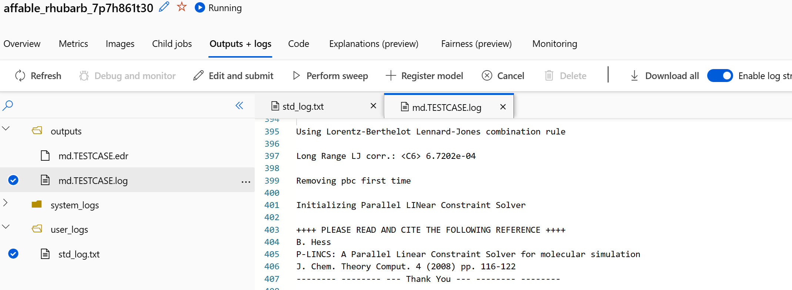
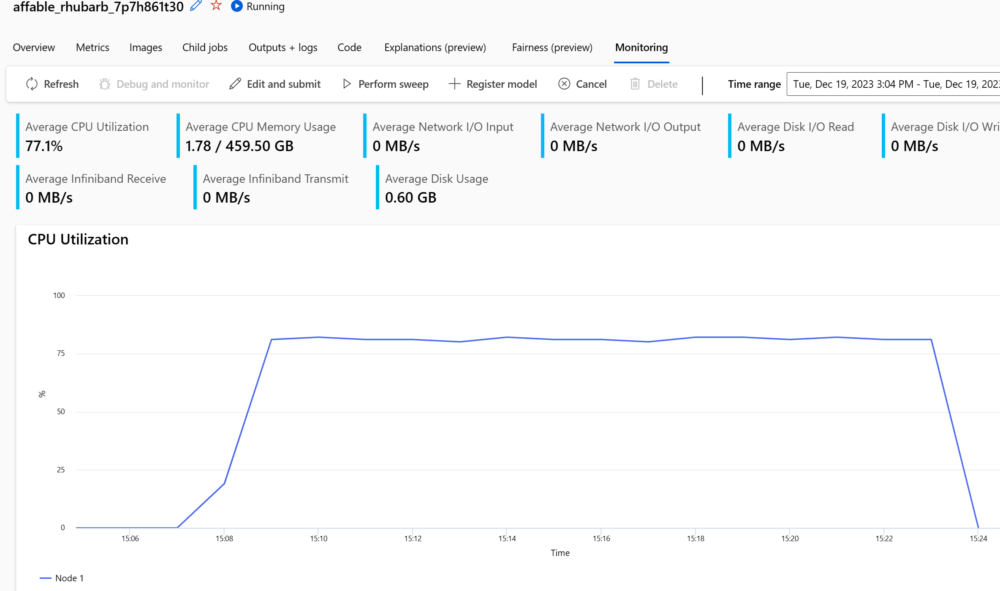
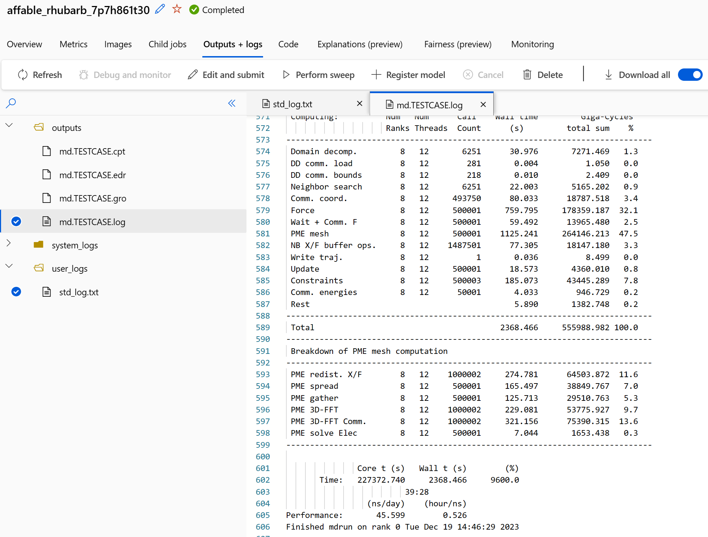

# GROMACS

Gromacs is a free and open-source software suite for high-performance molecular dynamics and output analysis. The main website can be found here: https://www.gromacs.org/
For this example we are running a simulation that was build/designed for the Prace benchmarking suite and can be found here: https://repository.prace-ri.eu/git/UEABS/ueabs/-/tree/master

Since the software is used from the EESSI stack (http://www.eessi.io/), there is no need to compile or install any software. The dependencies for EESSI are
already integrated into the default container/environment.

In the workdir, the testcase is downloaded and unpacked. After that, cd into the testcase directory:
```
$ wget https://repository.prace-ri.eu/ueabs/GROMACS/2.2/GROMACS_TestCaseA.tar.xz
$ cd GROMACS_TestCaseA
$ ls -lh
total 4.7M
-rwxrwxrwx 1 root root 4.7M Mar  8  2021 ion_channel.tpr
```

Now create a small runscript to mount the EESSI stack, load Gromacs and run the job:
```
#!/bin/bash
mount -t cvmfs pilot.eessi-hpc.org /cvmfs/pilot.eessi-hpc.org
source /cvmfs/pilot.eessi-hpc.org/latest/init/bash
ml load GROMACS

export OMP_NUM_THREADS=12
export OMPI_ALLOW_RUN_AS_ROOT=1
export OMPI_ALLOW_RUN_AS_ROOT_CONFIRM=1

mpirun -np 8 gmx_mpi mdrun \
    -s ion_channel.tpr \
    -deffnm outputs/md.TESTCASE \
    -cpt 1000 \
    -maxh 1.0 \
    -nsteps 500000 \
    -ntomp $OMP_NUM_THREADS
```

With this runscript, the job can be submitted:
```
$ sbatch -p hbv2 --datamover=simple ./runscript.sh 
Uploading GROMACS_TestCaseA (4.85 MBs): 100%|█████████████████████████████████████████| 4850498/4850498 [00:00<00:00, 26932111.50it/s]
affable_rhubarb_7p7h861t30
```

During the run, the "Output and logs" tab will be updated and can be tracked:


Also the cpu and memory usage can be tracked:


The final results can be found in that tab too: 


# run with multiple nodes

The next step is to run Gromacs over multiple nodes using MPI and the InfiniBand interconnect that is available on e.g. HB120rs_v2 vm's.
To do this, the runscript-2N.sh needs to be teaked to prepare the nodes and provide mpirun with the right variables:
```
#!/bin/bash
parallel-ssh -i -H "${AZ_BATCH_HOST_LIST//,/ }" "mount -t cvmfs pilot.eessi-hpc.org /cvmfs/pilot.eessi-hpc.org"
source /cvmfs/pilot.eessi-hpc.org/versions/2023.06/init/bash

ml load GROMACS
export OMP_NUM_THREADS=14
export OMPI_ALLOW_RUN_AS_ROOT=1
export OMPI_ALLOW_RUN_AS_ROOT_CONFIRM=1

for i in ${AZ_BATCH_HOST_LIST//,/ }
do
        echo "${i}:120" >> hostfile.txt
done

mpirun -x PATH -np 16 --map-by ppr:8:node --hostfile hostfile.txt gmx_mpi mdrun \
    -s ion_channel.tpr \
    -deffnm outputs/md.TESTCASE \
    -cpt 1000 \
    -maxh 1.0 \
    -nsteps 500000 \
    -ntomp $OMP_NUM_THREADS
```

now this can be submitted:
```
$ sbatch -p hbv2 -N 2 --datamover=simple ./runscript-2N.sh 
Uploading GROMACS_TestCaseA (4.85 MBs): 100%|█████████████████████████████████████████| 4851160/4851160 [00:00<00:00, 26590538.75it/s]
careful_nutmeg_sd06p39gn7
```
