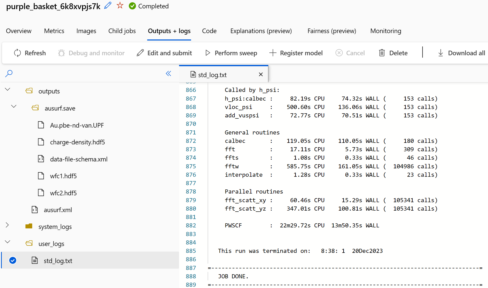

# QuantumESPRESSO

QuantumESPRESSO is an integrated suite of Open-Source computer codes for electronic-structure calculations and materials modeling at the nanoscale.
It is based on density-functional theory, plane waves, and pseudopotentials. More information can be found here: https://www.quantum-espresso.org/

To be able to run the application, the EESSI software stack was used. More information on EESSI can be found here: https://www.eessi.io/

As a testcase the input file from the small case from the Prace benchmark suite was used: https://repository.prace-ri.eu/git/UEABS/ueabs/-/tree/master/quantum_espresso

In the input file control section, the outdir was changed to ./outputs/ to align with Azure Machine Learning default setup.
```
&CONTROL
  title = ' DEISA pw benchmark ',
  calculation = 'scf',
  restart_mode = 'from_scratch', ! 'restart',
  tprnfor = .TRUE.,
  etot_conv_thr = 1.d-8,
  prefix = 'ausurf'
  pseudo_dir = './'
  outdir = './outputs/'
/
```

The runscript.sh is still pretty simple:
```
#!/bin/bash

echo "I'm running..."
mount -t cvmfs pilot.eessi-hpc.org /cvmfs/pilot.eessi-hpc.org
source /cvmfs/pilot.eessi-hpc.org/latest/init/bash
ml load QuantumESPRESSO 
export OMP_NUM_THREADS=4
export OMPI_ALLOW_RUN_AS_ROOT=1
export OMPI_ALLOW_RUN_AS_ROOT_CONFIRM=1

mpirun -n 30 pw.x -npool 2 -input ausurf.in 
```

And can be submitted from the testcase directory:
```
$ sbatch -p hbv2 --datamover=simple ./runscript.sh
Uploading small (0.32 MBs): 100%|████████████████████████████████████████████████████████| 322826/322826 [00:00<00:00, 3461939.67it/s]
purple_basket_6k8xvpjs7k
```

The results can be found in the "Output and logs" tab:

